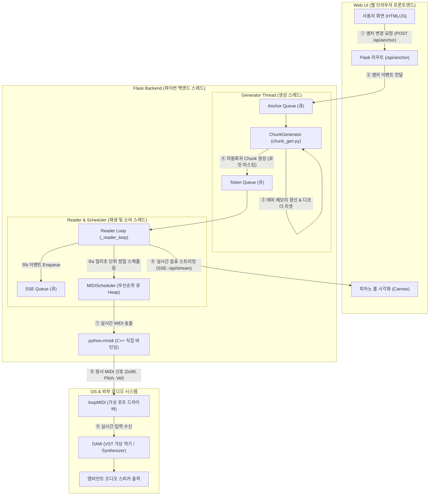

# ThemeTransformer 실시간 앰비언트 스트리밍 — 아키텍처 상세 (최신화)

학습된 ThemeTransformer(인코더-디코더 듀얼트랙 MIDI 생성 모델)로 **끊김 없이 연속적으로**
앰비언트 음악을 생성하고, 브라우저 피아노롤로 시각화하면서 동시에 loopMIDI 가상 포트를 통해
DAW(Cakewalk)로 실시간 MIDI를 내보내는 시스템의 전체 동작을 처음부터 끝까지 설명한다.

기준 경로는 **웹 서버**([webapp/server.py](../webapp/server.py))이다. CLI 경로
([main_streaming.py](../main_streaming.py) → [engine.py](../src/streaming/engine.py) →
[midi_out.py](../src/streaming/midi_out.py))는 같은 코어(`ChunkGenerator`)를 쓰는 더 단순한
대체 경로이며 마지막 절에서 차이만 짚는다.

> 이 문서는 실시간 처리량 문제(빈 피아노롤 / 노트 중첩 재생)를 해결한 이후의 **현재 코드**를
> 반영한다. 핵심 변경: anchor=컨텍스트 리셋, 주기적 theme 재등장, **최소 Time-Shift 강제(실시간
> 보증)**, GIL 경쟁 완화, 스레드 누수 수정, 노트/스레드 로깅.

---

## 0. 한눈에 보기

```
                                       [브라우저]
  Seed/Anchor 선택 ──HTTP──►  Flask  ◄──SSE(piano roll)── app.js
                                │
     ┌───────────────────────────┴────────────────────────────────────┐
     │                       WebSession                                 │
     │                                                                  │
 AnchorQueue ─► ChunkGenerator(thread) ─► TokenChunkQueue ─► _reader_loop(thread)
  (MIDI경로)      │ 자기회귀 토큰 생성        (maxsize=2)       │
                 │ · 인코더 theme 캐시                          ├─► TSDStreamingDecoder
                 │ · 인코더 메모리/마스크 캐시                    │     토큰→절대시간 노트
                 │ · 문법 로짓 마스킹                            │
                 │ · 밀도 캡 + 최소 Time-Shift(실시간 보증)        ├─► sse_q ─► SSE ─► 피아노롤
                 │ · seed/anchor 주입, 주기적 theme 재등장          │
                 └ _emit(stop-aware put)                          └─► MIDIScheduler(thread)
                                                                       wall-clock 우선순위 큐
                                                                       └─ rtmidi ─► loopMIDI ─► DAW
```

핵심 원리 4가지:

1. **생성(토큰)과 재생(시간) 분리.** 모델은 토큰만 빠르게 뽑고, 시간 해석·스케줄링은 별도가 한다.
2. **사전버퍼 후 클록 동기.** 몇 초 분량을 미리 만든 뒤 서버/클라이언트 클록을 **같은 epoch
   순간**에 출발 → 피아노롤과 소리가 어긋나지 않는다.
3. **문법은 로짓 마스킹으로 강제**(forward 1회 = 유효토큰 1개), **밀도/최소 Time-Shift로 음악
   속도를 실시간 위로 보증**한다.
4. **GIL 친화 설계.** 토큰당 비용이 GPU 연산이 아니라 Python/런치 오버헤드(=GIL 점유)라, 다른
   스레드(스케줄러 등)가 GIL을 적게 잡도록 만들어 생성 속도를 지킨다.

---

## 1. 토큰 표현 (TSD) — [preprocess/vocab.py](../preprocess/vocab.py)

모델 단위는 MIDI가 아니라 **TSD(Time-Shift/절대시간) 토큰**이다.

- **시간 해상도** `time_resolution = 0.04`(40ms). 모든 시간은 이 스텝의 정수배.
- **트랙**은 program으로 식별: `MELODY = 0`, `PAD = 88`.
- 토큰: `Note-On-{MELODY|PAD}_{pitch}`, `Note-Duration-..._{steps}`,
  `Note-Velocity-..._{vel}`, `Time-Shift_{steps}`(1~100, 토큰당 최대 4초),
  `Theme_Start`/`Theme_End`, `padding`(id 0).
- **노트 1개 = 3토큰**: `Note-On → Note-Duration → Note-Velocity`(동일 트랙). 시간은 노트 사이
  `Time-Shift`로만 전진(절대시간 누적).

`Vocab.midi2TSD(path)`가 MIDI→토큰 id 리스트(seed/anchor 로딩), `TSDID2midi`가 역변환.

---

## 2. 모델 — [mymodel.py](../mymodel.py) / [myTransformer.py](../myTransformer.py)

`myLM`: 인코더-디코더 트랜스포머(`d_model=256`, `num_encoder_layers=6`,
`xorpattern=[0,0,0,1,1,1]`). 인코더는 theme 시퀀스를 메모리로, 디코더는 컨텍스트(self-attn)+
인코더 메모리(cross-attn)로 다음 토큰 로짓을 낸다.

### 2.1 encode/decode 분리 (스트리밍 fast-path)
theme이 자주 안 바뀌므로 인코더를 매 토큰 돌리지 않는다 ([mymodel.py:119](../mymodel.py#L119)):
- `encode_theme(src)` → 인코더 메모리. **theme이 바뀔 때만** 호출.
- `decode_step(tgt, memory, tgt_label, tgt_mask)` → 캐시된 메모리에 디코더만 forward.

### 2.2 cross-attention 라벨 게이팅 ★ (anchor/recurrence 설계의 근거)
디코더 각 위치에 **label**이 붙는다: `0`=자유 생성, `1,2,3…`=테마 영역 내부 순번. cross-attention
출력은 **label>0에서만 살아남는다** ([myTransformer.py:567-573](../myTransformer.py#L567)):

```python
gate_msk = (tgt_label.unsqueeze(2)...).bool()
tgt2_cross = gate_msk * tgt2_cross        # label==0 → cross-attn 출력 0
tgt3 = (tgt2_self + tgt2_cross) / 2.0
```

- **테마 영역(label>0)**: 인코더 theme을 직접 참조 → theme을 재현/변형.
- **자유 생성(label 0)**: cross-attn이 죽어 **인코더 theme을 직접 못 봄**. theme 영향은 오직
  **디코더 컨텍스트(self-attn)**를 통해 간접 전파.

> 이 게이팅이 **anchor=컨텍스트 리셋**(§4.3)과 **주기적 theme 재등장**(§4.4)의 이유다.

---

## 3. 컴포넌트별 상세

### 3.1 ChunkGenerator — [src/streaming/chunk_gen.py](../src/streaming/chunk_gen.py)

토큰을 자기회귀로 생성해 `TokenChunkQueue`로 밀어 넣는 백그라운드 **생산자 스레드**.

#### 캐시 (theme 교체 시에만 갱신)
- 인코더 메모리: `_ensure_memory` — `_theme_ver`가 바뀔 때만 `encode_theme` 재실행
  ([:282](../src/streaming/chunk_gen.py#L282)).
- **인과 마스크**: `_causal_mask` — `max_len×max_len`를 한 번만 만들고 매 토큰 슬라이스
  ([:325](../src/streaming/chunk_gen.py#L325)). 매 토큰 512×512 텐서 생성+GPU 복사하던 순수
  오버헤드 제거(생성은 오버헤드/ GIL 바운드라 효과가 큼).

#### 문법 로짓 마스킹 — forward 1회 = 유효 토큰 1개
직전 토큰 종류에 따라 다음 허용 토큰만 남기고 나머지 로짓을 `-inf`
([_allow_mask:145](../src/streaming/chunk_gen.py#L145)):
- `Note-On-{tr}` → `Note-Duration-{tr}`만 / `Note-Duration-{tr}` → `Note-Velocity-{tr}`만
- free 상태 → `Note-On` 또는 `Time-Shift`. reject-resample 루프 없음.

#### 밀도 제어 + 실시간 보증 ★ (_build_grammar_masks, _allow_mask)
음악시간은 Time-Shift로만 전진하므로, 시간 전진을 보장하지 않으면 모델이 화음을 쌓아 클록을
굶긴다. 다음으로 묶는다:
- `max_consec_notes`(기본 4): 노트 N개 후 **Time-Shift 강제**.
- `max_consec_shifts`(기본 2): Shift 연속 후 **노트 강제**(긴 침묵 방지).
- `max_timeshift`(기본 25): Time-Shift 상한(멀티초 공백 방지).
- **`min_force_shift`(기본 12) ★ 실시간 보증**: Time-Shift **하한**. 이게 없으면 모델이 매번
  1~2스텝(~0.08s)만 밀며 화음을 쌓아 **토큰당 음악시간이 거의 0 → 생성이 0.2x로 붕괴**(=빈 롤 +
  과거 노트 즉시 발사로 인한 중첩 재생). 하한을 두면 노트 그룹마다 음악이 최소
  `min_force_shift × 0.04 × time_scale`초 전진해 **항상 실시간을 앞선다**
  ([:101](../src/streaming/chunk_gen.py#L101)).
- pitch는 `pitch_min`/`pitch_max`만 허용(음역 마스킹).

#### 샘플링
허용 마스크 → temperature → softmax → nucleus(top-p) → 다항 추출
([_sample_logits:292](../src/streaming/chunk_gen.py#L292)).

#### 생성 음악시간 시계
`_append_token`이 Time-Shift를 더할 때 `_music_sec += steps × 0.04 × time_scale`를 누적
([:222](../src/streaming/chunk_gen.py#L222)). 주기적 theme 재등장 타이밍의 기준.

#### stop-aware emit (스레드 누수 방지) ★
`_emit`은 큐가 꽉 차도 영원히 블록하지 않고 `timeout=0.2`로 재시도하며 stop 이벤트를 확인
([:343](../src/streaming/chunk_gen.py#L343)). 과거엔 reader 정지 시 생성기가 `put`에서
영구 블록되어 **종료되지 않던 스레드 누수**가 있었다.

#### 메인 루프 (`run` → `_run_once`, [:367](../src/streaming/chunk_gen.py#L367))
```
_run_once():
  1.  AnchorQueue 확인 → 있으면 _inject_anchor 후 ("anchor",label,tokens) emit, return
  1b. 주기적 theme 재등장 due면 _reinject_theme 후 ("theme","THEME",tokens) emit, return
  2.  chunk_size(32) 토큰 생성 — 매 토큰 전 anchor/recur due 확인(즉시 반영) → ("generated",..) emit
```
`run()`이 `_run_once()`를 try/except로 감싸 transient 오류로 스트림이 죽지 않게 하고,
스레드 START/EXIT를 로그로 남긴다.

### 3.2 큐 — [src/streaming/buffer.py](../src/streaming/buffer.py)
- `AnchorQueue`: `(label, midi_path)` thread-safe 큐, 생성기가 `get_nowait()`로 논블로킹 확인.
- `TokenChunkQueue(maxsize=2)`: 생성기→reader 유한 큐. 작게 둔 이유 — 깊으면 anchor가 미리
  만든 버퍼 뒤에 붙어 늦게 재생됨. `put(item, timeout=...)` 지원(누수 방지).
  항목은 `(kind, label, token_ids)`, `kind ∈ {generated, anchor, theme}`.

### 3.3 TSDStreamingDecoder — [webapp/server.py:48](../webapp/server.py#L48)
토큰 청크 → 절대 음악시간 노트 이벤트. 청크 경계를 넘어 상태 유지.
- 누적시간 `self.t`를 들고 `Time-Shift`마다 `steps × 0.04 × time_scale` 전진.
- `Note-On→Duration→Velocity`가 모이면 `{kind:"note", t, pitch, dur, vel, track, src}` 방출.
- 경계 처리: Duration/Velocity가 청크에 안 들어왔으면 `_buf`/`_pending`에 보관해 다음 청크에 이음.
- `time_scale`(기본 **1.0**): Time-Shift·Duration 양쪽에 곱하는 후처리 배율. 작을수록 촘촘하지만
  토큰당 음악시간이 줄어 실시간 여유가 감소(§5).

### 3.4 MIDIScheduler — [webapp/server.py:115](../webapp/server.py#L115)
노트 이벤트를 **wall-clock**(`time.perf_counter()`) 기준으로 rtmidi에 정확히 전송하는 스레드.
- `start(wall_start)`: 기준 시각 설정. **`_pq`를 비워 이전 세션의 묵은 노트가 새 세션에 섞이지
  않게 함** ([:169](../webapp/server.py#L169)).
- `schedule(ev)`: 음악시간 `t`를 `wall_start + t`로 변환해 Note-On/Off를 우선순위 큐에 push.
- `_loop()` ★ GIL 친화: 다음 이벤트까지 **길게 sleep**(`min(fire_at-now, 0.1)`)
  ([:201](../webapp/server.py#L201)). 과거의 5ms 바쁜 루프는 GIL을 갉아먹어 생성 스레드를
  ~3배 굶겼다(생성이 오버헤드/ GIL 바운드라 치명적).
- `panic()`: 16채널 CC120/CC123(All Sound/Notes Off). `stop()`이 호출.

### 3.5 WebSession — [webapp/server.py:238](../webapp/server.py#L238)
컴포넌트 통합. 생성자에서 seed로 인코더 theme(`Theme_Start+seed+Theme_End`)을 만들어
ChunkGenerator 생성 + `init_seed(seed)`로 디코더 컨텍스트에 seed 리터럴 삽입, `_pending`에
시작 이벤트(SEED 마커 + seed 노트) 적재.

---

## 4. 동작 시나리오

### 4.1 시작 (`/api/start` → `WebSession.start`, [:312](../webapp/server.py#L312))
```
start():
  _gen.start()
  while decoder.t < prebuffer: 청크 당겨 디코딩(워밍업)
  _wall_start = perf_counter(); _wall_start_epoch = time(); scheduler.start(_wall_start)
  _pending 일괄 schedule + SSE 방출
  reader_thread 시작; [session] START 로그(gen_id/reader_id/prebuffer/epoch)
```
빈 버퍼로 클록을 시작하면 seed가 묻히고 언더런이 난다. prebuffer로 채운 뒤 서버/클라 클록을
같은 epoch 순간에 출발시킨다. 응답에 `wall_start_epoch` 포함(→§5).

### 4.2 정상 재생 (`_reader_loop`, [:389](../webapp/server.py#L389))
```
loop:
  if (decoder.t - elapsed) > lead_cap: sleep(0.05); continue   # 백프레셔
  kind,label,tokens = token_q.get()
  kind=="anchor" → 마커 방출 + [reader] ANCHOR 로그 / kind=="theme" → [reader] THEME 로그
  for ev in decoder.feed(tokens, src): sse_q.put(ev); scheduler.schedule(ev)
      # 각 노트는 터미널에 [note #N] mus_t/play_t/lead/pitch/dur/track/src 로 출력
      # lead<0이면 "<<< PAST (pile-up!)" — 과거로 스케줄=실시간 미달 신호
```
`lead_cap`(기본 5s)이 백프레셔: reader가 늦으면 `TokenChunkQueue`가 차서 생성기가 자연 정지 →
생성이 재생보다 약 `lead_cap`초 이상 앞서지 않음.

### 4.3 Anchor 주입 (`_inject_anchor`, [:225](../src/streaming/chunk_gen.py#L225)) ★ 컨텍스트 리셋
`/api/anchor` → `feed_anchor` → `AnchorQueue` → 생성기가 처리:
1. anchor MIDI→토큰.
2. `update_theme([Theme_Start,*anchor,Theme_End])` — **인코더 theme 교체**(`_theme_ver`++ →
   다음 `_ensure_memory`에서 인코더 재계산).
3. **`init_seed(anchor_tokens)`로 디코더 컨텍스트 리셋** — anchor를 새 seed로 취급.
4. `("anchor",label,tokens)` emit → reader가 그 시점 `decoder.t`에 마커 + 리터럴 재생.

> §2.2 게이팅 때문에 **3번(리셋)이 핵심**이다. 자유 생성(label 0)은 인코더 theme을 직접 못
> 보고 컨텍스트로만 영향받는다. anchor를 기존 컨텍스트에 *덧붙이면* 옛 theme으로 발전된 ~수백
> 토큰이 self-attention을 지배해 anchor가 "잠깐 나왔다 사라진다". 리셋하면 새 theme에서부터
> 발전 → anchor가 새 지배 theme이 된다.

### 4.4 주기적 theme 재등장 (`_reinject_theme`, [:258](../src/streaming/chunk_gen.py#L258)) ★
게이팅 때문에 anchor 영역이 512-윈도를 벗어나면 theme grounding이 옅어진다(drift). 이를 막기
위해 **생성 음악 `theme_recur_sec`(기본 16s)마다** 현재 theme을
`[Theme_Start,*theme,Theme_End]` labeled 영역으로 컨텍스트에 다시 넣고 **리터럴 재생**한다
(seed/anchor의 "삽입된 theme은 들린다" 원칙). 이는 (a) cross-attn을 theme에 재grounding +
(b) 모티프 재진술을 함께 한다. anchor와 달리 **컨텍스트를 리셋하지 않아** 그동안의 발전은 유지.
재등장 토큰은 `("theme","THEME",tokens)`로 emit되어 anchor 색으로 표시·재생된다.

### 4.5 정지 / 패닉
- `/api/stop` → `WebSession.stop()`: `_running=False` → `_gen.stop()` + `scheduler.stop()`
  (내부 `panic()`) → **gen/reader 스레드 join(2s)** 후 종료 여부 로그(`STOP complete` 또는
  `STOP WARNING - threads still alive`) ([:352](../webapp/server.py#L352)).
- `/api/panic`: 세션 정지 + All Sound/Notes Off(긴급).
- 서버 종료: `atexit`+SIGINT/SIGTERM가 `panic()` 호출.

---

## 5. 실시간 처리량 모델 ★ (이 시스템의 생명선)

**핵심 사실: 토큰당 비용 ~30–33ms는 문맥 길이와 거의 무관 = CUDA 연산이 아니라 커널런치/Python
오버헤드(GIL 점유) 지배.** 따라서:

- **KV 캐시/짧은 문맥은 도움 안 됨**(연산이 병목이 아님).
- **다른 스레드의 GIL 사용을 줄이면 생성이 빨라짐** → 스케줄러 루프를 길게 sleep(§3.4),
  마스크 캐시(§3.1). 단독 1.5x였던 생성이 멀티스레드에선 GIL 경쟁으로 ~0.5x까지 떨어졌었다.

실시간 계수(대략):
```
realtime ≈ (토큰당 평균 음악시간) / (토큰당 wall시간)
         = (avg_shift_steps × 0.04 × time_scale) / (~0.032s + GIL 경쟁분)
```
- `time_scale`에 **선형 비례**. 1.0에서 ~1.15–1.5x, 0.5면 절반 → sub-realtime.
- **`min_force_shift`가 avg_shift_steps의 하한을 보장** → 밀도 폭주 시에도 realtime>1 유지.
  현재 기본(`time_scale=1.0`, `min_force_shift=12`)에서 실측 **~1.15x**, 과거-스케줄 노트 ~0.

**sub-realtime이 되면**: 생성 프론티어가 플레이헤드에 추월당해 (1) 피아노롤 앞쪽이 텅 비고,
(2) 과거 시각으로 스케줄된 노트가 즉시 한꺼번에 발사되어 **중첩(불협)으로 들린다**. 진단은
터미널의 `<<< PAST (pile-up!)` 라인으로 즉시 확인 가능(§7).

> 버퍼(`prebuffer`/`lead_cap`)를 키우는 건 해결이 아니다 — realtime<1이면 버퍼가 아무리 커도
> 결국 추월당한다. **realtime을 1 위로 올리는 것(=min_force_shift↑ 또는 time_scale↑)만이 해결.**

---

## 6. 클록과 동기화 ★

| 주체 | 시계 | 용도 |
|------|------|------|
| MIDIScheduler | `time.perf_counter()`(단조) | 노트 발사 |
| 클라이언트(app.js) | `Date.now()`(epoch) | 피아노롤 플레이헤드 |
| 동기화 다리 | `time.time()` = `wall_start_epoch` | 두 시계 기준점 일치 |

서버는 클록 출발 순간의 epoch(`wall_start_epoch`)를 `/api/start` 응답에 실어 보내고, 클라이언트는
`wallStart = wall_start_epoch*1000`, `musicalNow() = (Date.now()-wallStart)/1000`으로 **서버와
같은 epoch 기준 음악시간**을 얻는다 ([app.js:110](../webapp/static/app.js#L110),
[:185](../webapp/static/app.js#L185)). `_wall_start`(perf)와 `_wall_start_epoch`(epoch)는
`start()`의 인접 줄에서 거의 동시에 찍혀 같은 순간을 가리킨다.

---

## 7. 관측성 (터미널 로깅)

실시간/스레드 문제를 눈으로 잡기 위한 로그:
- **노트 스트림**: `[note #N] mus_t=.. play_t=.. lead=±.. p=.. d=.. TRACK src` — `lead<0`이면
  `<<< PAST (pile-up!)`(=실시간 미달). reader가 스케줄하는 모든 노트를 출력.
- **스레드 수명**: `[gen] thread START/EXIT`, `[reader] START/EXIT(streamed N notes)`,
  `[session] START/STOP …`. 재시작 시 이전 스레드가 **EXIT 되는지**, `STOP WARNING`(누수)이
  뜨는지 확인 가능.
- **삽입 이벤트**: `[ChunkGenerator] anchor '...' injected`, `[reader] ANCHOR/THEME @ mus_t=..`.

> 노트 로그는 콘솔 I/O(GIL)를 약간 쓴다. 실측상 realtime에 큰 영향은 없으나, 운영 시 줄이고
> 싶으면 reader의 per-note print를 토글로 막으면 된다(향후 env 토글 가능).

---

## 8. 프론트엔드 — [webapp/static/app.js](../webapp/static/app.js)
- `EventSource("/api/stream")` SSE. 서버 `/api/stream`은 `sse_q`를 0.05s로 drain해 이벤트 배열을
  흘리고, 없으면 keepalive.
- `requestAnimationFrame(draw)`가 매 프레임 렌더: 가로=시간 윈도 `[ph-PAST, ph+FUTURE]`,
  세로=pitch 12–108. seed/gen/anchor × MELODY/PAD 색상, 플레이헤드 이전=불투명/이후=반투명,
  anchor 글로우, seed/anchor 마커 점선.
- **오디오는 브라우저에서 안 냄.** 소리는 전적으로 서버→loopMIDI→DAW. 피아노롤은 시각화 전용.

---

## 9. 스레딩 / GIL 모델

| 스레드 | 역할 | 통신 |
|--------|------|------|
| Flask(메인+워커) | HTTP/SSE | `SESSION`(락), `sse_q` |
| ChunkGenerator | 토큰 생성(생산자) | `AnchorQueue` 소비, `TokenChunkQueue` 생산 |
| `_reader_loop` | 토큰→이벤트, 백프레셔, 라우팅, 노트 로깅 | `TokenChunkQueue` 소비 → `sse_q`/scheduler |
| MIDIScheduler `_loop` | wall-clock 발사(GIL 친화 sleep) | 우선순위 큐(락) |

동기화: `SESSION_LOCK`(세션 교체), `_theme_lock`(theme/메모리 교체), `MIDIScheduler._lock`(큐),
큐 자체(thread-safe). **역압**: `TokenChunkQueue(maxsize=2)` + `lead_cap`. **누수 방지**:
`_emit`의 stop-aware put + `stop()`의 join/경고. **GIL 보호**: 스케줄러 길게 sleep + 마스크 캐시.

---

## 10. 튜닝 포인트 (UI 슬라이더 / `/api/start`)

| 파라미터 | 기본 | 효과 |
|----------|------|------|
| `time_scale` | **1.0** | 노트 밀도/템포. 작을수록 촘촘하지만 realtime↓(§5). |
| `min_force_shift`(UI "min gap") | **12** | Time-Shift 하한. **realtime 보증 노브.** 낮추면 촘촘하나 sub-realtime 위험, 높이면 성기고 안전. |
| `theme_recur_sec`(UI "theme recur") | **16** | theme 재등장 간격(생성 음악 초). 0=끔. |
| `temperature`/`top_p` | 1.0/0.9 | 다양성/안정성. 높으면 드리프트↑. |
| `pitch_min`/`pitch_max` | 0/127 | 생성 음역. |
| `lead_cap` | 5 | 생성 선행 버퍼 상한(백프레셔). |
| `prebuffer` | 4 | 시작 전 사전버퍼(초). |
| `max_consec_notes`/`max_consec_shifts`/`max_timeshift` | 4/2/25 | 화음 크기·연속 shift·shift 상한. |

> ⚠️ realtime은 **time_scale × min_force_shift(및 밀도 캡)**의 함수다. `time_scale`을 내리면
> `min_force_shift`를 올려야 실시간이 유지된다.

---

## 11. 해결해 온 핵심 문제 (요약)

1. **MIDI 잔류음** → `panic()` + atexit/SIGINT.
2. **노트 띄엄띄엄** → `time_scale` 후처리 압축.
3. **재생되는데 화면에 없음** → 피아노롤 pitch 범위 12–108.
4. **피아노롤-MIDI 싱크** → `wall_start_epoch`로 클록 기준점 통일(§6).
5. **피아노롤 전체 공백(★)** → `init_seed`의 `Theme_End`/label 누락 버그 수정.
6. **처리량 급감/자동정지** → 문법 **로짓 마스킹** + 인코더 메모리 캐시.
7. **빈 버퍼 시작** → `prebuffer` 워밍업 후 클록 동기 출발.
8. **anchor 지연·theme 미교체** → anchor=labeled 영역+인코더 교체, 버퍼 축소.
9. **anchor가 잠깐 나왔다 사라짐** → **anchor=컨텍스트 리셋**(§4.3).
10. **theme 색이 유지 안 됨(drift)** → **주기적 theme 재등장**(§4.4).
11. **빈 롤 + 노트 중첩 재생(★ 실시간 붕괴)** → 원인은 모델이 tiny shift로 화음을 쌓아 음악시간이
    안 늘던 것. **`min_force_shift`를 문법 마스크에 연결(실시간 보증)** + **스케줄러 GIL 완화** +
    **마스크 캐시**. realtime 0.2–0.5x → ~1.15x, pile-up 수백→0.
12. **스레드 누수(종료 안 됨)** → 생성기 `_emit`(stop-aware put) + `stop()` join/경고.
13. **세션 전환 시 묵은 노트 중첩** → `MIDIScheduler.start`에서 `_pq` 비움.

---

## 12. CLI 경로와의 차이 (참고)
[main_streaming.py](../main_streaming.py)→[engine.py](../src/streaming/engine.py)→
[midi_out.py](../src/streaming/midi_out.py)는 웹 없이 도는 단순 경로다. 같은 `ChunkGenerator`
코어를 쓰지만 피아노롤/SSE/클록 동기/prebuffer/주기적 재등장 UI가 없고, `MIDIOutputEngine`이
토큰을 직접 소비하며 자체 stream-clock으로 sleep해 재생한다(우선순위 큐 대신 인라인 시간 진행,
Note-Off는 전용 스레드). theme은 시작 시 `--theme`로 고정, anchor는 표준입력 `a <path>`.
`TokenChunkQueue` 항목이 `(kind, tokens)` 2-튜플로 웹(3-튜플)과 다르다. 웹 경로가 운영 대상,
CLI는 로컬 점검용.
```

## 13. 실시간 시그널 플로우 (Signal Flow)

현재 웹 기반 스트리밍 시스템의 실제 데이터 흐름 및 스레드 간 상호작용 도식입니다.



